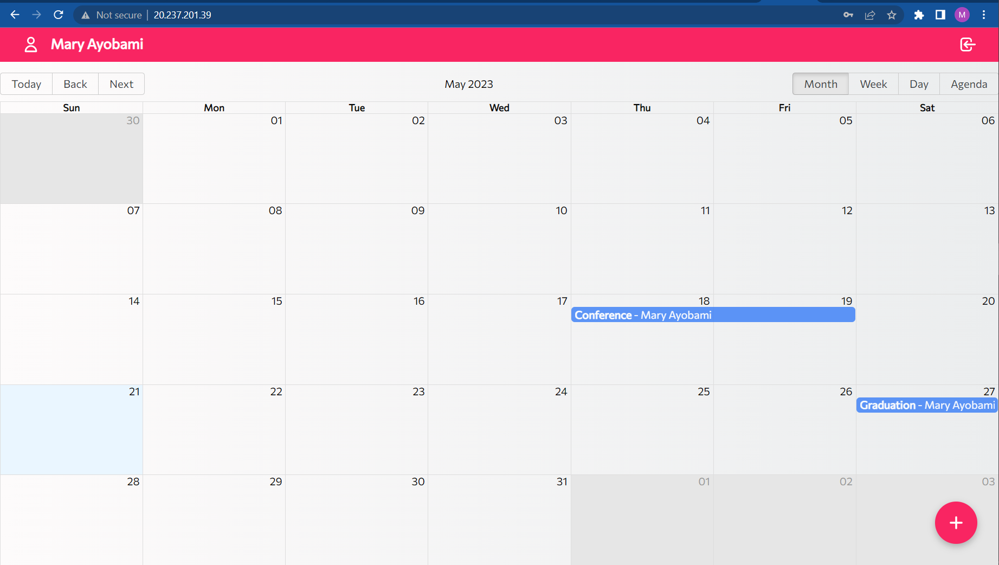
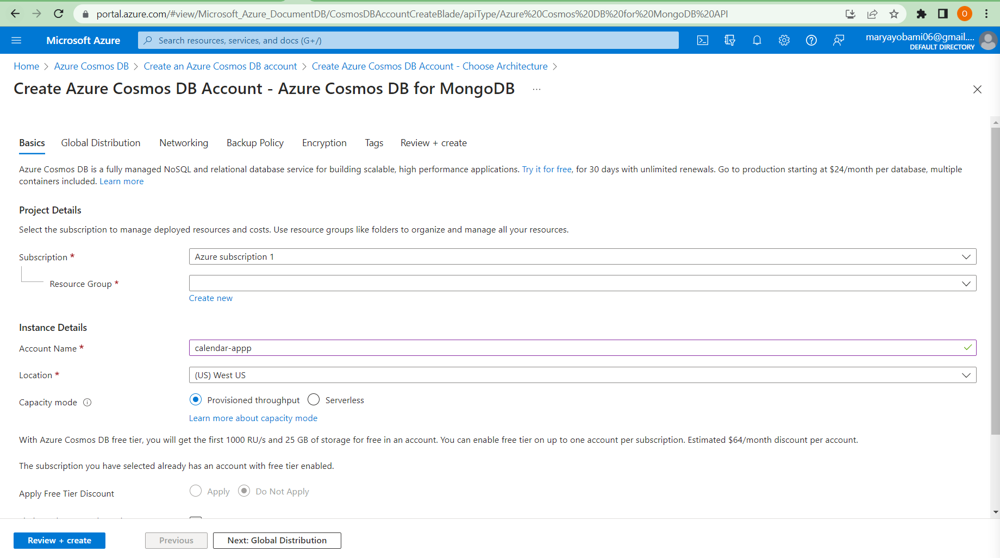
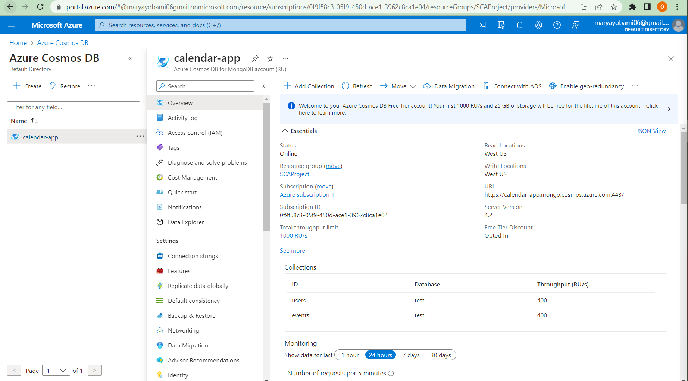
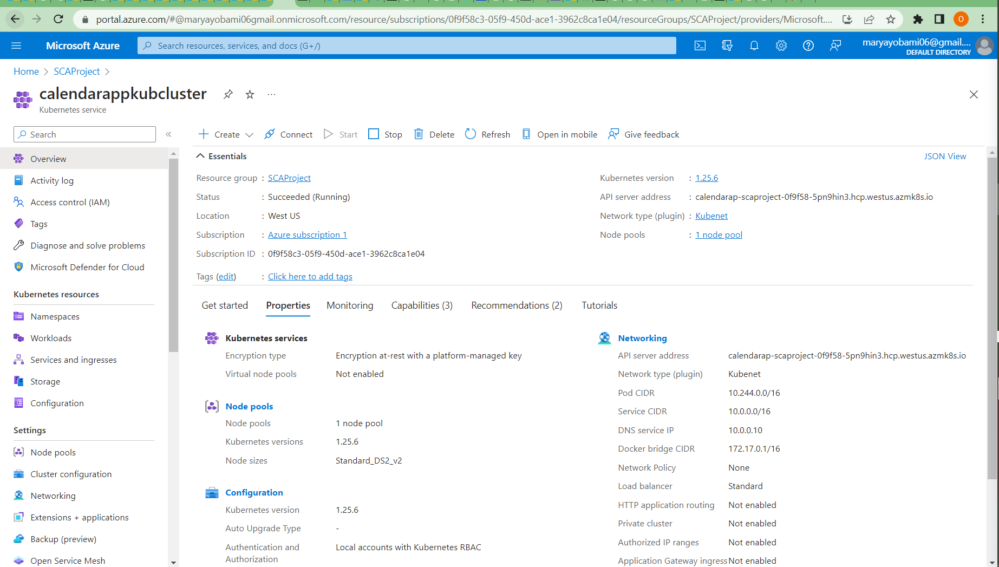
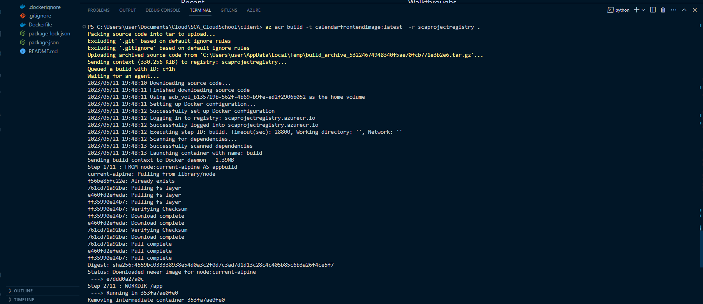
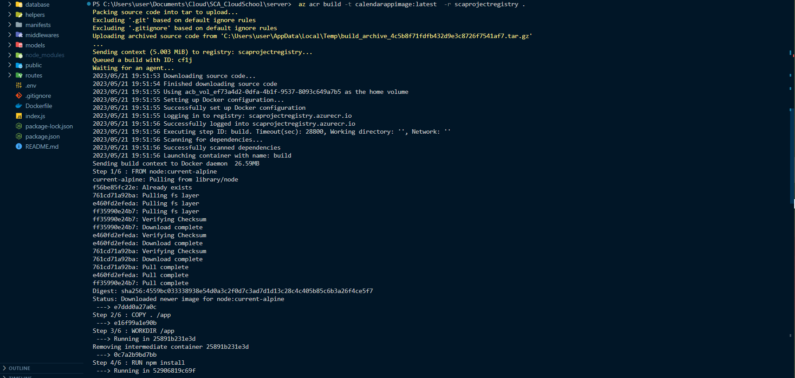
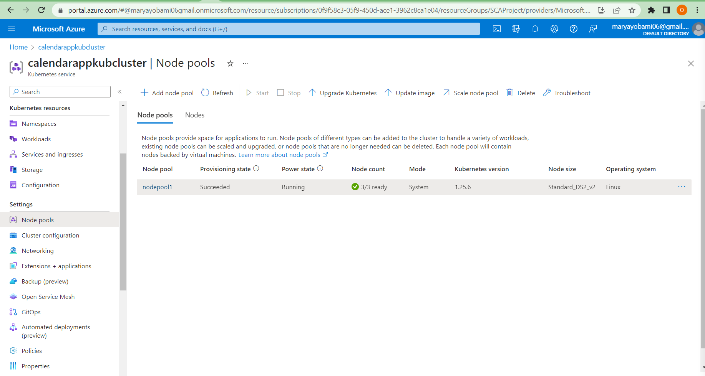
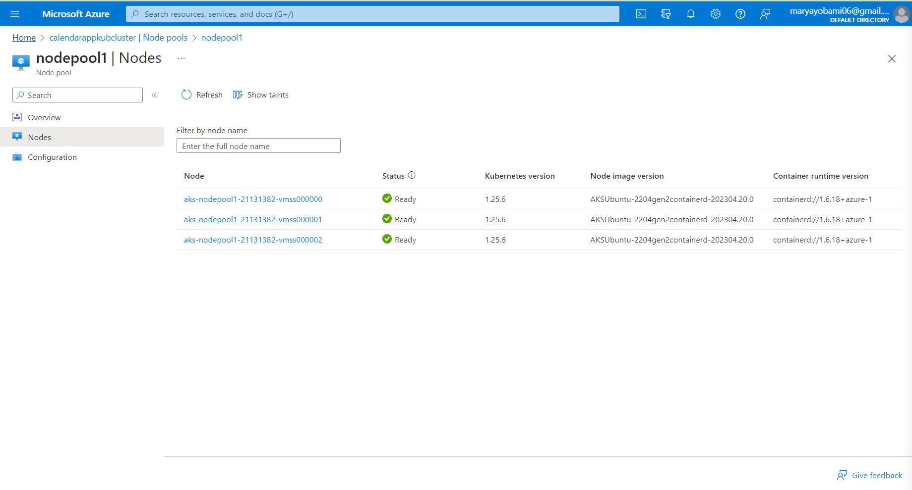
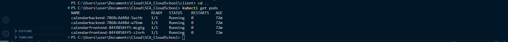
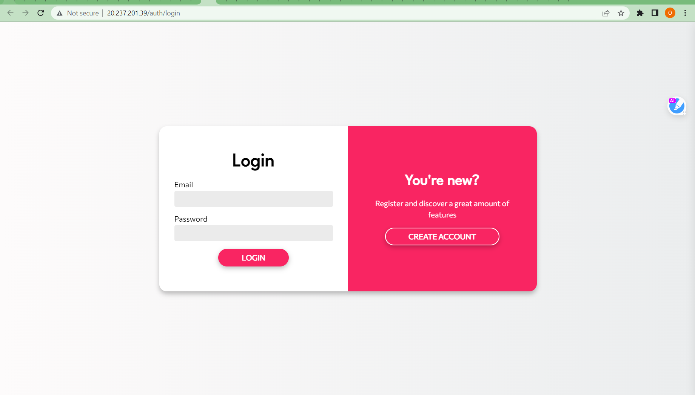

# CalendaPlus

CalendaPlus is a cloud-based calendar web application developed using the MERN (MongoDB, Express, React, Node.js) stack, making it a robust and efficient solution for managing events and
schedules. It provides functionality for creating, editing, deleting, and listing events. This application is a fork of the original project available [here](https://github.com/juanpmachadob/mern-calendar).

  > # Table of Contents 
    1. Description
      - Frontend 
      - Backend 
      - Database 
    2. Deployment
      - Breakdown
    3. Accessing the Application 

# Description 
## Frontend 
The client-side (frontend) of the application is located in the client branch of this repository. It has been developed using React, a popular JavaScript
library for building user interfaces. The frontend provides a user-friendly interface for interacting with the calendar and managing events.

##  Backend 
The server-side (backend) of the application is located in the server branch of this repository. It has been developed using Node.js, a JavaScript runtime, along with Express.js, a minimal and flexible web application framework. The backend handles various operations related to
events, such as creating, updating, and deleting events, as well as retrieving event data from the database.

##  Database 
CalendaPlus uses Azure Cosmos DB for MongoDB as its database. Azure Cosmos DB is a globally distributed, multi-model database service
provided by Microsoft. It offers high scalability, low latency, and automatic indexing of data. The backend is connected to the database
using a connection string, allowing seamless communication between the application and the database.

*An image of the databse on the Azure portal*

# Deployment 
The frontend and backend of CalendaPlus are deployed on a single Kubernetes cluster using Azure Kubernetes Service (AKS). This
cloud-native approach ensures high availability, scalability, and easy management of the application.

#  Breakdown
To deploy CalendaPlus, the following steps were performed:

- Docker images were created for both the frontend and backend components
of the application. These images contain all the necessary dependencies
and configurations to run the respective services.

- The Docker images were pushed to the Azure Container Registry. Azure
Container Registry is a private container registry that allows storing
and managing Docker container images.

- A Kubernetes cluster was created using Azure Kubernetes Service (AKS).
The cluster consists of a node pool, with 3 nodes. AKS
provides a managed Kubernetes environment, simplifying the deployment
and management of containerized applications.

- Azure Kubernetes Service was authorized to pull images from the Azure
Container Registry. This allows the Kubernetes cluster to access the
required Docker images for running the frontend and backend services.

- The deployment and service files, located in the manifests folder, were
used to deploy the container images to the Kubernetes cluster. These
files define the desired state of the application and provide
instructions for creating and managing the necessary resources.

*An image of the running pods*

- To allow external services, such as web browsers, to access the backend
service running on the Kubernetes pod (which has a ClusterIP service
type), Nginx was used as a reverse proxy server. Nginx directs API calls
from the frontend application to the IP address of the pod running the
backend container.

*The Application*

# Accessing the Application 
To access the CalendaPlus application, use the
following URL: *http://20.237.201.39/*
